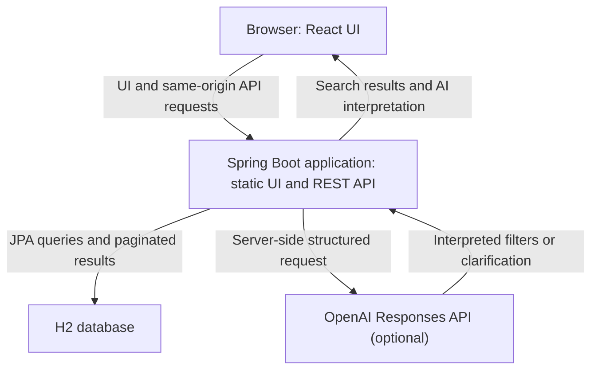

# Copart Vehicle Search

A full-stack vehicle search prototype built for a Software Engineering Intern take-home assignment. It provides a responsive search UI, a paginated REST API, and optional AI-assisted interpretation of natural-language search requests.

**Live demo:** [copart-vehicle-search.up.railway.app](https://copart-vehicle-search.up.railway.app/)

All vehicle records are synthetic. This project does not use or represent live Copart inventory.

## What it does

- Search by keyword across lot number, make, model, and location.
- Filter by make, model, primary damage, condition, year range, and estimated value.
- Sort and paginate results; the UI offers page sizes of 12, 24, 48, and 96.
- Search with regular keywords using **Search** or Enter, or send the same text to **Ask AI** to interpret it into supported filters.
- Ask AI can return a clarification question. When it can interpret the request, the UI applies the filters through the same vehicle-search endpoint and keeps any remaining keyword (such as a location) in the search field.
- Share or reload a search using its URL. Browser Back and Forward restore prior applied searches.
- Save vehicles in browser local storage. Saved vehicles synchronize across tabs in the same browser profile, but not across devices or separate profiles.
- View loading, validation, service-error, and no-results states. For very small result sets, the UI can suggest removing an active filter.

## Technologies

| Area | Technologies in this repository |
| --- | --- |
| Frontend | React 19, JavaScript, Vite 6, HTML5, CSS3 |
| Backend | Java 17, Spring Boot 3.5.5, Spring Web, Spring Data JPA, Hibernate, Jakarta Bean Validation |
| Database | H2; file-based for the application and in-memory for tests |
| AI integration | OpenAI Responses API, called server-side with Java's built-in `HttpClient`; structured JSON is parsed with Jackson |
| Frontend tests | Vitest, React Testing Library, `user-event`, jsdom |
| Backend tests | JUnit 5 and Spring Boot Test, including MockMvc |
| Build and deployment | Maven, npm, multi-stage Dockerfile, Railway |

No separate Node.js server runs in production: Node is used by the Docker build stage to build the React assets. The Spring Boot application serves those static assets and the API from the same origin.

## Architecture



### Architecture decisions

| Decision | Why this fits this prototype | Trade-off |
| --- | --- | --- |
| React UI with a Spring Boot REST backend | React handles interactive filters, results, and shared search state. Spring provides a Java API with clear controller, service, repository, and entity boundaries. | The client and backend are separate codebases, although they ship together. |
| JPA Specifications for vehicle search | Optional search criteria are composed into database predicates, so filtering, sorting, and pagination happen in the database rather than loading every record into application memory. | Substring keyword search is simple `LIKE` matching, not fuzzy or relevance-ranked search. |
| H2 and a deterministic seed dataset | H2 keeps the take-home easy to run without provisioning a database. A fixed-seed generator makes the 300 records reproducible. | H2 is suitable for this prototype, not a durable production inventory database. The repository does not configure a persistent Railway volume. |
| One Docker deployment | The Dockerfile builds React, copies its static files into Spring Boot's resources, and packages one runnable application. This keeps browser requests same-origin and avoids a separate frontend service or CORS setup. | UI and API are deployed and scaled together. |
| AI as an optional query interpreter | AI maps a natural-language request to a strict filter schema; the normal vehicle API still performs the actual search. The backend validates interpreted values against the project's supported catalog. | It requires a server-side API key, sends the submitted query to OpenAI, adds latency, and has usage limits. It is not required for ordinary keyword search. |
| Applied search state in the URL | Search links can be shared and refreshed, and browser history restores earlier applied filters. | Only applied criteria are serialized; unsent edits in the form are not. |

The backend search path is `VehicleController → VehicleService → VehicleRepository`, with `VehicleSearchSpecification` building optional criteria. The `Vehicle` entity declares indexes for make/model, model year, condition, and primary damage; the free-text substring query spans lot number, make, model, and location. The AI path is `AiSearchController → AiSearchService`; interpreted filters return to the frontend, which submits them to the ordinary vehicle-search endpoint.

## Search API

### Health

```http
GET /api/health
```

Response: `{"status":"UP"}`

### Search vehicles

```http
GET /api/vehicles?q=Dallas&make=Toyota&page=0&size=12&sortBy=saleDate&direction=asc
```

| Parameter | Behavior |
| --- | --- |
| `q` | Case-insensitive partial match across lot number, make, model, and location. For example, `q=Dallas` matches a location containing “Dallas”. |
| `make`, `model` | Case-insensitive exact matches. |
| `primaryDamage`, `condition` | Case-insensitive exact matches. Damage and condition are separate fields. |
| `minYear`, `maxYear` | Inclusive year bounds. The API rejects an inverted range. |
| `minPrice`, `maxPrice` | Estimated-value bounds. The lower bound is inclusive and the upper bound is exclusive. |
| `maxPriceInclusive` | Inclusive maximum estimated value; used by AI-parsed “up to” requests. It cannot be combined with `maxPrice`. |
| `page` | Zero-based page index; defaults to `0`. |
| `size` | Results per page; API accepts 1–100 and defaults to `12`. |
| `sortBy` | One of `year`, `make`, `model`, `saleDate`, `estimatedValue`, or `odometer`; defaults to `saleDate`. |
| `direction` | `asc` or `desc`; defaults to `asc`. Ties are ordered by id to keep page ordering stable. |

The response contains `content` plus `number`, `size`, `totalElements`, `totalPages`, `first`, and `last`. Each vehicle includes `id`, `lotNumber`, `year`, `make`, `model`, `primaryDamage`, `condition`, `location`, `saleDate`, `odometer`, and `estimatedValue`.

The API returns HTTP 400 for invalid page or size values, unsupported sort values, inverted year ranges, or negative/conflicting/inverted price bounds. The UI uses zero-based page indexes for API requests and displays page numbers starting at one in the URL.

### AI interpretation API

```http
POST /api/ai-search
Content-Type: application/json
```

Request fields: `query` is required (1–300 characters); `clarification` is optional (up to 300 characters).

```json
{
  "query": "Silverado under $5,000 near Dallas",
  "clarification": ""
}
```

The response is either:

- `READY`, with supported filters such as make, model, primary damage, condition, year bounds, maximum price, and residual keyword `q); or
- `CLARIFICATION`, with a short question when the request cannot be mapped safely to the available catalog.

AI output uses a strict JSON schema and is checked against supported makes, models, damage types, conditions, year limits, and price limits before it is returned. The user query is sent from the backend to the OpenAI Responses API; the API key is never placed in frontend code. Without a configured key, this endpoint returns HTTP 503. Rate limits return HTTP 429 with a `Retry-After` header; an upstream AI failure returns HTTP 502.

## Data and database

The seed file is `backend/src/main/resources/vehicles.json`. It contains 300 fictional lots: 10 makes, 3 models per make, and 10 lots per model. The records include locations, sale dates, years, damage, condition, odometer, and estimated value. Values and sale details are generated data, not current market valuations or auction listings.

Generate the seed file with:

```sh
node scripts/generate-vehicles.mjs
```

The generator uses a fixed random seed, so running it again produces the same dataset. Images are bundled WebP assets selected by vehicle model; they are illustrative and are not lot-specific photographs.

The application defaults to the file-based H2 URL `jdbc:h2:file:./data/copartdb`. When started from the `backend` directory, the database files are under `backend/data`. Hibernate updates the local schema. At startup, the seed loader compares stored rows with the bundled seed file; if they differ, it replaces the stored rows with the seed data.

Tests use a separate in-memory H2 database with a create-and-drop schema. The H2 web console is disabled by default. To enable it for local development only, set `H2_CONSOLE_ENABLED=true`; it is available at `/h2-console`.

The Dockerfile does not mount a persistent volume. Do not rely on the hosted H2 file surviving a container replacement. For durable or production data, use a managed database and configure its credentials and storage separately.

## Run locally

Requirements: Java 17, Maven, Node.js 22, and npm.

Start the backend in one terminal:

```sh
cd backend
mvn spring-boot:run
```

The backend listens on port 8080 by default and loads the seed data at startup. Start the frontend in another terminal:

```sh
cd frontend
npm install
npm run dev
```

Open the local URL printed by Vite. During development, Vite proxies `/api` requests to `http://localhost:8080`.

Run checks independently:

```sh
cd frontend
npm test
npm run build
```

```sh
cd backend
mvn test
```

GitHub Actions runs frontend tests, a production frontend build, and backend tests for pull requests and pushes to `main`.

## Configuration

| Environment variable | Purpose |
| --- | --- |
| `PORT` | HTTP port; defaults to 8080. Railway supplies this when deployed. |
| `OPENAI_API_KEY` | Enables AI interpretation. Keep it server-side and out of Git. |
| `OPENAI_MODEL` | Overrides the model name; the repository configuration defaults to `gpt-5.6-luna`. |
| `AI_SEARCH_LIMIT_PER_MINUTE` | Per-client AI request limit; defaults to 10. |
| `AI_SEARCH_LIMIT_PER_HOUR` | Overall AI request limit; defaults to 200 per running application instance. |
| `H2_CONSOLE_ENABLED` | Enables the local H2 console; defaults to false. |

AI rate-limit counters are held in application memory. They reset on restart and are independent per application instance; they are not a distributed quota across multiple replicas.

## Deployment

The repository-root `Dockerfile` is a multi-stage build:

1. Node.js 22 builds the Vite frontend.
2. Maven with Eclipse Temurin 17 builds the Spring Boot jar and includes the frontend files as static resources.
3. Eclipse Temurin 17 JRE runs the combined application.

Build and run the image locally from the repository root:

```sh
docker build -t copart-vehicle-search .
docker run --rm -p 8080:8080 -e PORT=8080 copart-vehicle-search
```

The Railway service uses the repository-root Dockerfile and serves the frontend and API from one public URL. Configure `OPENAI_API_KEY` as a Railway service variable if AI interpretation is needed; ordinary vehicle search does not require it.

## Scope and limitations

- Synthetic seed data and illustrative images; no live Copart inventory or lot-specific photos.
- No authentication, authorization, user accounts, or saved-vehicle synchronization across devices.
- H2 is used by the application; production-grade database persistence and schema migrations are not configured in this repository.
- Keyword matching is case-insensitive substring matching, not fuzzy, typo-tolerant, or relevance-ranked search.
- AI interpretation depends on an external OpenAI API and configured credentials. It supplements the deterministic search API and is optional.
- Rate limiting is in-memory and per running instance; use a shared limiter if multiple instances must enforce a single global quota.
